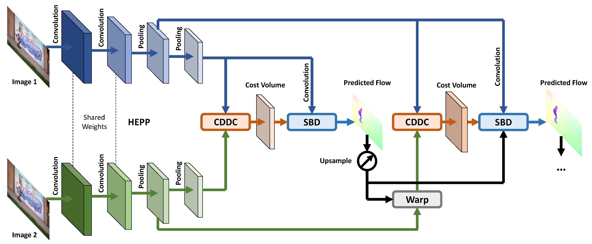

# FastFlowNet: A Lightweight Network for Fast Optical Flow Estimation
The official PyTorch implementation of [FastFlowNet] (ICRA 2021).

Authors: [Lingtong Kong](https://dblp.org/pid/261/8152.html), [Chunhua Shen](https://cshen.github.io/), [Jie Yang](http://www.pami.sjtu.edu.cn/jieyang)

## Network Architecture
Dense optical flow estimation plays a key role in many robotic vision tasks. It has been predicted with satisfying accuracy than traditional methods with advent of deep learning. However, current networks often occupy large number of parameters and require heavy computation costs. These drawbacks have hindered applications on power- or memory-constrained mobile devices. To deal with these challenges, in this paper, we dive into designing efficient structure for fast and accurate optical flow prediction. Our proposed FastFlowNet works in the well-known coarse-to-fine manner with following innovations. First, a new head enhanced pooling pyramid (HEPP) feature extractor is employed to intensify high-resolution pyramid feature while reducing parameters. Second, we introduce a novel center dense dilated correlation (CDDC) layer for constructing compact cost volume that can keep large search radius with reduced computation burden. Third, an efficient shuffle block decoder (SBD) is implanted into each pyramid level to acclerate flow estimation with marginal drops in accuracy. The overall architecture of FastFlowNet is shown as below.

## NVIDIA Jetson TX2
Optimized by [TensorRT](https://developer.nvidia.com/tensorrt), proposed FastFlowNet can approximate real-time inference on the Jetson TX2 development board, which represents the first real-time solution for accurate optical flow on embedded devices. For training, please refer to [PWC-Net](https://github.com/NVlabs/PWC-Net) and [IRR-PWC](https://github.com/visinf/irr), since we use the same datasets, augmentation methods and loss functions. Currently, only pytorch implementation and pre-trained models are available. A demo video for real-time inference on embedded device is shown below, note that there is time delay between real motion and visualized optical flow.

## Optical Flow Performance
Experiments on both synthetic [Sintel](http://sintel.is.tue.mpg.de/) and real-world [KITTI](http://www.cvlibs.net/datasets/kitti/) datasets demonstrate the effectiveness of proposed approaches, which consumes only 1/10 computation of comparable networks ([PWC-Net](https://github.com/NVlabs/PWC-Net) and [LiteFlowNet](https://github.com/twhui/LiteFlowNet)) to get 90\% of their performance. In particular, FastFlowNet only contains 1.37 M parameters and runs at 90 or 5.7 fps with one desktop NVIDIA GTX 1080 Ti or embedded Jetson TX2 GPU on Sintel resolution images.

Some visual examples on several image sequences.

  
  
    
  
  
    
  
  
  

|             | Sintel Clean Test (AEPE) | KITTI 2015 Test (Fl-all) | Params (M) | FLOPs (G) | Time (ms) 1080Ti | Time (ms) TX2 |
|:-----------:|:------------------------:|:------------------------:|:----------:|:---------:|:----------------:|:-------------:|
|   FlowNet2  |           4.16           |          11.48%          |   162.52   |  24836.4  |        116       |      1547     |
|    SPyNet   |           6.64           |          35.07%          |    1.20    |   149.8   |        50        |      918      |
|   PWC-Net   |           4.39           |           9.60%          |    8.75    |    90.8   |        34        |      485      |
| LiteFlowNet |           4.54           |           9.38%          |    5.37    |   163.5   |        55        |      907      |
| FastFlowNet |           4.89           |          11.22%          |    1.37    |    12.2   |        11        |      176      |
